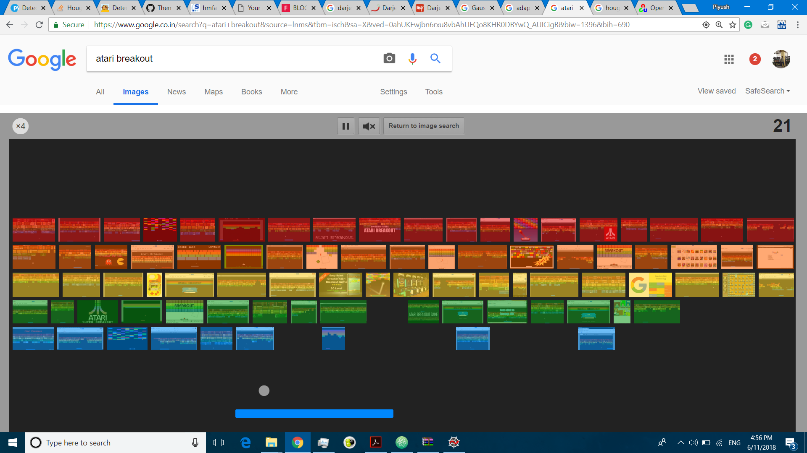
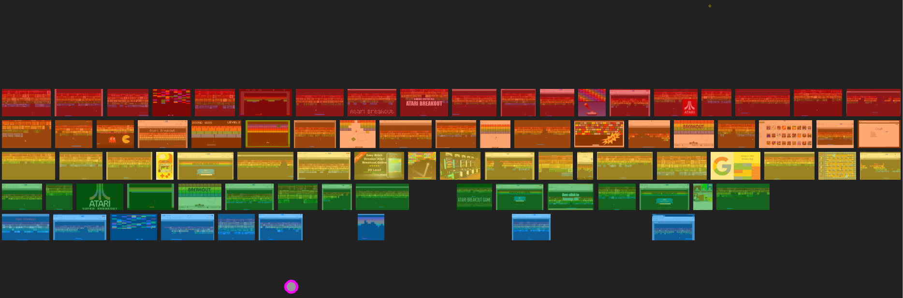

 

# Game_Learner
An ML Project to train the computer to play a game

## Milestones
 - [x] Select Game to learn from --> [HIDDEN GAME ON GOOGLE! (Atari Breakout!)](https://www.google.co.in/search?q=atari+breakout&source=lnms&tbm=isch&sa=X&ved=0ahUKEwjs4Pnsho3bAhXGQ48KHSikCa4Q_AUICigB&biw=1396&bih=690&dpr=1.38)
 - [x] Extract training data
 - [ ] Train NN
 - [ ] *Testing* - Let it Play

## Extracting Data from Sample_image.png using OpenCV

Sample Image

### After running 1shot_test.py we get the location of ball and plate

Ball with purple boundary

Plate with white boudary

## Contributers
- [Piyush Ranjan](https://github.com/piyush27ranjan/) - [View Contributions](https://github.com/piyush27ranjan/Game_Learner/commits?author=piyush27ranjan)
- [Piyush Chauhan](https://github.com/piyushchauhan/) - [View Contributions](https://github.com/piyush27ranjan/Game_Learner/commits?author=piyushchauhan)
